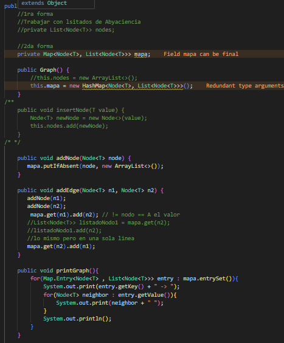

# Práctica: Estructuras No Lineales - 

## Autor
- Nombre: Antonio Carvelli
- Carrera/Curso: Estructura de Datos

##  Práctica de Árboles – Implementación Integers- 2026-01-05
- Práctica:  Práctica de Árboles – Implementación Integers
- Fecha: [2026-01-05]

## Descripción
Implementamos un árbol binario de búsqueda donde los valores menores van a la izquierda y los mayores a la derecha.
Inicialmente el tamaño del árbol se calculaba recorriendo todos los nodos (O(n)), pero lo optimizamos agregando un contador size que se incrementa cada vez que se inserta un nodo nuevo.

## Evidencias
### Captura 1
Inserta aquí la captura del código o de la ejecución.
- Archivo: 

### Captura 2 
Inserta aquí una segunda captura si aplica.
- Archivo: .png)

##  Práctica de Árboles – Implementación Generico uso de  interfaces - 05/01/2026

## Evidencias
### Captura 1
En ambas capturas se muestra el uso de la implementación genérica del árbol binario de búsqueda con diferentes tipos de datos (Strings y Doubles)

En la primera captura se muestra la inserción y recorrido de Strings.

En la segunda captura se muestra la inserción y recorrido de Doubles.

la segunda esta como clase generica
- Archivo: 
- Archivo: 
### Captura 2 
Inserta aquí una segunda captura si aplica.
- Archivo: 
- Archivo: 

##  Práctica de Árboles – Implementación Generico uso de  interfaces - 05/01/2026

## Evidencias
### Captura 1
En ambas capturas se muestra el uso de la implementación genérica del árbol binario de búsqueda con diferentes tipos de datos (Strings y Doubles)

En la primera captura se muestra la inserción y recorrido de Strings.

En la segunda captura se muestra la inserción y recorrido de Doubles.

la segunda esta como clase generica
- Archivo: 
- Archivo: 
### Captura 2 
Inserta aquí una segunda captura si aplica.
- Archivo: 
- Archivo: 

##  Práctica de Graphs - 2026-01-08
- Práctica:  Práctica de Graphs
- Fecha: [2026-01-08]

## Descripción
Creamos nodos, junto a su lista de lso que conoce donde los incrimos y luego mostramos

para luego mostrar a sus vecinos

## Evidencias
### Captura 1
Inserta aquí la captura del código o de la ejecución.
- Archivo: 
- Archivo: 

### Captura 2 
aqui ,mostramos los vecinos de A tambien
- Archivo: !

##  Práctica de Graphs - 2026-01-20
- Práctica:  Práctica de 
- Fecha: [2026-01-20]

## Descripción
Creamos nnodos, junto a su lista de lso que conoce donde los incrimos y luego mostramos

para luego mostrar a sus vecinos

## Evidencias
### Captura 1
Inserta aquí la captura del código o de la ejecución.
- Archivo: 
- Archivo: 

### Captura 2 
la busqueda profunda revisaremos los conocidos del nodo y despues al vvecino de ese hasta llegar a l final
- Archivo: !

